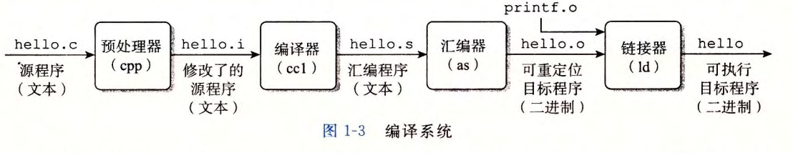
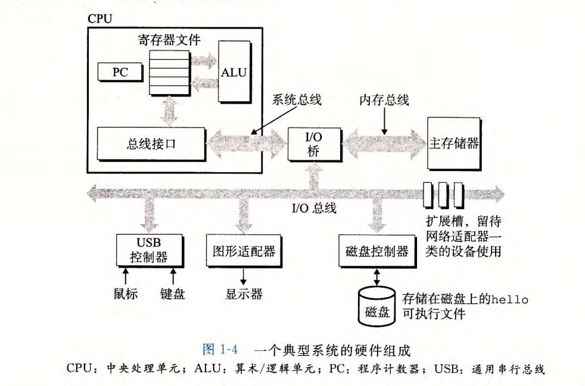
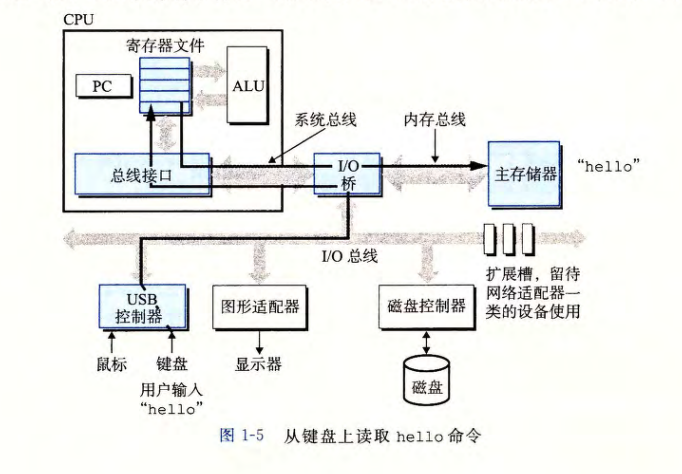
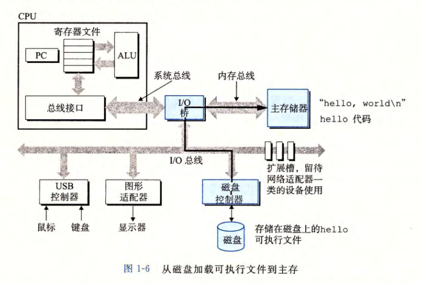
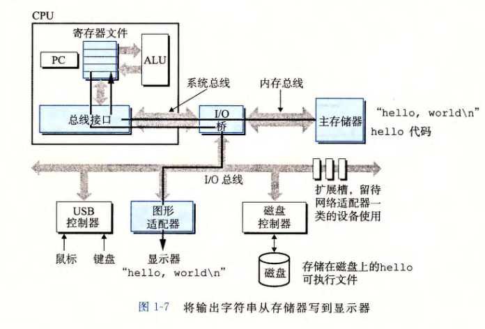
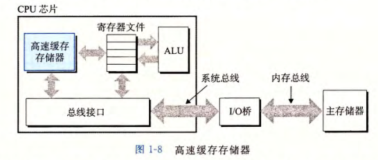
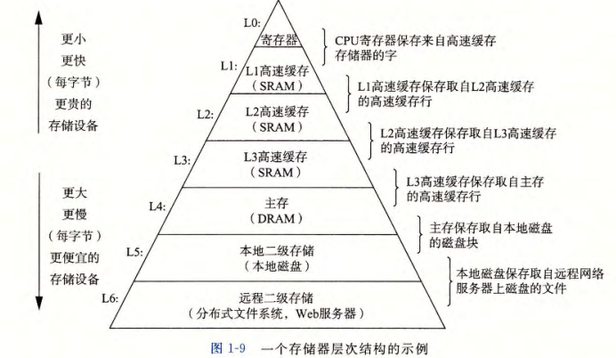
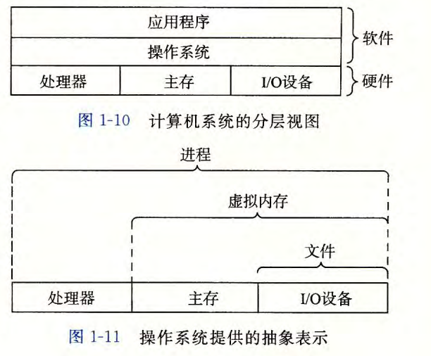
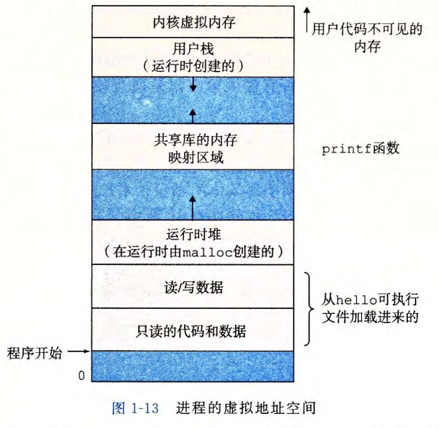

## 1.1 信息就是位+上下文

**所有文件本质上都是二进制文件**
硬盘和内存里存储的都是一长串由 `0` 和 `1` 组成的字节流。我们之所以将它们区分为两类，是因为**解释数据的方式（上下文）不同**：
- **文本文件**：严格按照某种字符编码表（如 ASCII、UTF-8）进行排版的二进制文件。每个字节（或每几个字节）都能对应一个人类可读的字符。用普通的文本编辑器（如记事本）打开不会乱码。
- **二进制文件**：没有按照通用的字符编码表组织，而是按照特定的业务逻辑、算法或机器指令集排布。强行用记事本打开会显示乱码，必须使用对应的专用软件（如图片查看器、音乐播放器）去解析。

<mark>信息 = 位 + 上下文：这是全书的核心定理。相同的字节序列，在不同的上下文解读下，会产生完全不同的含义。</mark>

ASCII 字符在底层**直接对应二进制码的**，之所以强调它对应的“整数值是 65”，是为了：
- **服务人类大脑**：人类大脑不擅长阅读和记忆冗长的 `0` 和 `1`，用十进制整数（如 `65`）作为二进制的“小名”，更方便人类进行逻辑沟通和编写教材。
- **方便字符运算**：在程序设计中，将字符看作整数可以进行非常优雅的数学运算。例如，大写字母 `'A'`（65）和小写字母 `'a'`（97）在 ASCII 表中正好相差 `32`，通过加减法就能直接完成大小写转换。
- **硬件设计一致性**：CPU 内部的 **ALU（算术逻辑单元）** 天生就是设计来处理整数加减法电路的。将字符映射为整数，可以让 CPU 用同一套硬件电路。

## 1.2 程序被其他程序翻译成不同的格式

图1-3

- **预处理阶段**：预处理器（cpp）处理以 `#` 开头的命令（如包含头文件），修改原始的 C 程序，生成以 `.i` 为扩展名的文本文件。
- **编译阶段**：编译器（ccl）将 `.i` 文件翻译成包含汇编语言程序的文本文件 `.s`。汇编语言描述了低级机器语言指令，为不同高级语言的编译器提供了通用的输出语言。
- **汇编阶段**：汇编器（as）将 `.s` 文件翻译成机器语言指令，并打包成“可重定位目标程序”的二进制文件 `.o`。如果在文本编辑器中打开该文件会显示为乱码。
- **链接阶段**：链接器（ld）负责将程序调用的库函数（如 `printf.o`）与目标文件（如 `hello.o`）进行合并，最终生成可执行目标文件，供系统加载到内存中执行。

## 1.4 处理器读并解释储存在内存中的指令

#### 1. 4. 1 系统的硬件组成

图1-4

- **总线 (Buses)**:总线是贯穿整个系统的电子管道，负责在各个部件间传递字节信息。 总线通常传送定长的字节块，即字 (word)。字长是系统基本参数，大多数机器字长为 4 字节（32 位）或 8 字节（64 位）。
- **I/O 设备 (I/O Devices)**:I/O 设备是系统与外部世界的联系通道。例如键盘、鼠标、显示器和磁盘。 每个 I/O 设备通过控制器（设备本身或主板上的芯片组）或适配器（插在主板插槽上的卡）与 I/O 总线相连，负责在总线和设备间传递信息。
- **主存 (Main Memory)**:主存是临时存储设备，用来存放运行中的程序和处理器处理的数据。 物理上由 DRAM（动态随机存取存储器） 芯片组成。逻辑上是一个线性的字节数组，每个字节有唯一的地址（从零开始）。
- **处理器 (Processor)**:处理器 (CPU) 是执行主存中指令的引擎。核心是大小为一个字长的寄存器，称为程序计数器 (PC)，始终指向主存中的某条机器语言指令。 处理器执行的简单操作 {围绕着主存、寄存器堆(register file) 和算术／逻辑单 (ALU) 进行} 主要包括：
	加载：从主存复制字节或字到寄存器。
	存储：从寄存器复制字节或字到主存。
	操作：把两个寄存器的内容复制到 ALU 进行算术运算，结果存回寄存器。 
	跳转：从指令中抽取一个字复制到 PC，改变执行顺序。 
**我们需要区分描述每条机器代码指令效果的指令集架构 (ISA)，与描述处理器实际具体实现的微体系结构。**

#### 1. 4. 2 运行 hello 程序

图1-5

当用户在键盘上输入命令 `./hello` 时，系统通过以下路径将输入的字符串读入内存：
- **交互过程**：`shell` 程序执行指令，等待用户输入。
- **数据流向**：
	1. 用户在**键盘**输入字符。
    2. 字符通过 **USB 控制器** 进入 **I/O 总线**。
    3. 经过 **I/O 桥** 和**系统总线**，逐个字读入 **CPU 的寄存器文件**。
    4. CPU 再将这些字符通过**系统总线**、**I/O 桥**和**内存总线**存入主存储器（内存）中。

图1-6

当用户敲击键盘上的“回车键”后，`shell` 知道命令输入结束，开始加载程序：
- **交互过程**：`shell` 执行一系列指令，准备加载可执行文件 `hello`。
- <mark><strong>核心技术 (DMA)</strong>：利用直接存储器存取（DMA）技术，数据可以绕过处理器，直接从磁盘到达主存。</mark>
- **数据流向**：
    - **磁盘**上的代码和数据（包括字符串 `"hello, world\n"`） $\rightarrow$ **磁盘控制器** $\rightarrow$ **I/O 总线** $\rightarrow$ **I/O 桥** $\rightarrow$ **内存总线** $\rightarrow$ **主存储器**。

图1-7

一旦 `hello` 目标文件中的指令和数据被加载到主存，CPU 就会开始执行其 `main` 函数中的机器语言指令：
- **交互过程**：处理器执行指令，将要显示的字符串传送到显示设备。
- **数据流向**：
    1. **从主存到寄存器**：CPU 将字符串 `"hello, world\n"` 从**主存储器**通过总线复制到 **CPU 寄存器文件**中。
    2. **从寄存器到显示器**：CPU 再将字符串从**寄存器文件**通过总线和 **I/O 桥** 复制到**图形适配器（显卡）**。
    3. 最终由图形适配器驱动**显示器**，将字符串渲染在屏幕上。

## 1.5 高速缓存至关重要 /1.6 存储设备形成层次结构

图1-8

- **数据复制的开销**：系统花费了大量时间把信息从一个地方挪到另一个地方，这些复制开销属于开销，减慢了程序的“真正”工作。
- **性能与成本的物理制约**：根据机械原理，较大的存储设备比较小的存储设备运行得慢，而快速设备的造价远高于同类的低速设备。
- **CPU 与主存的鸿沟**：典型的寄存器文件只存储几百字节的信息，而主存可存放几十亿字节。然而，处理器从寄存器文件中读数据比从主存中读取几乎快 100 倍。
- **高速缓存的引入**：针对这种处理器与主存之间的差异，系统设计者采用了更小更快的存储设备，称为高速缓存存储器（cache），作为暂时的集结区域。通常包含 L1（位于 CPU 芯片上，容量数万字节，几乎与寄存器一样快）、L2（容量数十万到数百万字节，比 L1 慢 5 倍但比主存快 5~10 倍）以及 L3 高速缓存，它们由静态随机访问存储器（SRAM）实现。
- **局部性原理**：系统能通过高速缓存获得大容量且高速度的访问，利用的是**局部性原理**，即程序具有访问局部区域里的数据和代码的趋势。

图1-9

- **存储器层次结构的金字塔模型**：在层次结构中，从上至下，设备的访问速度越来越慢、容量越来越大、并且每字节的造价也越来越便宜。
    - **L0（寄存器）**：CPU 寄存器文件，保存来自高速缓存存储器的字。
    - **L1 到 L3（高速缓存）**：均采用 SRAM 构建，分别占据层次结构的第 1 层到第 3 层，逐级保存来自低一层的高速缓存行。
    - **L4（主存）**：主存由 DRAM 构建，保存来自本地磁盘的磁盘块。
    - **L5（本地二级存储）**：本地本地磁盘，保存来自远程网络服务器上磁盘的文件。
    - **L6（远程二级存储）**：分布式文件系统、Web 服务器等远程存储。
- **核心思想**：存储器层次结构的主要思想是**上一层的存储器作为低一层存储器的高速缓存**。

## <mark>1.7 操作系统管理硬件 </mark>

图1-11

1. 操作系统作为硬件与应用的“中介”
- **间接访问**：应用程序在运行时都**没有直接访问**键盘、显示器、磁盘或主存的权限。它们必须依靠操作系统提供的服务。
- **分层视图**：操作系统是插入在**应用程序**与底层硬件（处理器、主存、I/O设备）之间的一层软件（如文本图 1-10 所示）。所有应用对硬件的操作都必须通过操作系统。
2. 操作系统的两大基本功能
- 操作系统引入这层封装，主要是为了实现两个核心目标：
	1. **防止硬件被滥用**：防止底层硬件被失控的应用程序滥用或破坏。
	2. **屏蔽硬件复杂性**：向应用程序提供简单一致的机制，来控制复杂且通常大不相同的低级硬件设备。
 3. 三大核心抽象概念（图 1-11）
 - 为了实现上述两个功能，操作系统将复杂的底层硬件封装成了几个最基本的**抽象概念**：
	- **文件（Files）**：是对 **I/O 设备** 的抽象表示。
	- **虚拟内存（Virtual Memory）**：是对 **主存和磁盘 I/O 设备** 的抽象表示。
	- **进程（Processes）**：是对 **处理器、主存和 I/O 设备** 的整体抽象表示。
#### 1.7.1 [[进程]]

##### 1. 进程的核心定义与“幻象”

- **什么是进程**：进程是操作系统对一个**正在运行的程序**的一种抽象。
- **独占硬件的幻象**：当一个程序（如 `hello`）运行时，操作系统会提供一种假象，让程序觉得系统上**只有它自己在运行**，并且它独自占用了处理器、主存和 I/O 设备。
- **并发运行的本质**：在单处理器（单 CPU）系统中，并发（Concurrency）并不是真正的“同时执行”，而是通过处理器在多个进程之间交错执行指令（快速切换）来实现的。
##### 2. 上下文切换（Context Switch）

操作系统能够精准地在进程间切换，全靠对“上下文”的管理：
- **什么是上下文（Context）**：指操作系统保持跟踪进程运行所需的所有**状态信息**。包括程序计数器（PC）和寄存器文件的当前值，以及主存的内容。
- **切换过程**：当操作系统决定把控制权从当前进程转移到新进程时，就会执行**上下文切换**：
    1. 保存当前进程的上下文。
    2. 恢复新进程的上下文。
    3. 将控制权传递给新进程，新进程从上次停止的地方继续执行。
###### 4. 关键概念澄清：内核（Kernel）

- **内核的定义**：内核是操作系统代码中**常驻主存**的部分。
- **内核如何工作**：当应用程序需要操作系统执行某些操作（如读写文件）时，会执行一条特殊的系统调用指令，控制权就会传递给内核，由内核执行操作并返回结果。    
- **误区避免**：**内核并不是一个独立的进程**。相反，它是系统管理全部进程所用的代码和数据结构的集合
#### 1.7.2 线程

一个进程实际上 可以由多个称为线程的执行单元组成，每个线程都运行在进程的上下文中，并共享同样的 代码和全局数据。

#### 1.7.3 [[虚拟内存]]

图1-13

###### 虚拟内存的核心定义与假象
- **独占主存的假象**：虚拟内存为一个进程提供了一个假象，即该进程在独占地使用主存。
- **一致的地址空间**：每个进程所看到的内存结构都是一致的，这种统一的视觉被称为**虚拟地址空间**（在 Linux 及其他 Unix 系统中设计类似）。
###### 进程虚拟地址空间的层次结构

根据图 1-13 所示，Linux 进程的虚拟地址空间区域由低地址到高地址（自下而上增大）依次由以下专门的区构成：
- **程序代码和数据**：对所有进程而言，代码都从同一个固定地址开始。紧接着是和 C 全局变量相对应的区域。这部分内容（包括只读的代码/数据以及可读写的数据）是在进程一开始运行的时候，直接按照可执行目标文件（如 `hello`）的内容初始化的。
- **运行时堆（Heap）**：紧随代码和数据区之后。堆在程序一开始运行的时候就被指定了大小，但在程序执行期间，当调用像 `malloc` 和 `free` 这样的 C 标准库函数时，堆可以在运行时动态地扩展和收缩。
- **共享库（Shared Libraries）**：大约位于整个虚拟地址空间的正中间部分。这是一块用来存放像 C 标准库（例如 `printf` 函数）和数学库这样的共享库代码和数据的内存映射区域。
- **用户栈（Stack）**：位于用户虚拟地址空间顶部的下方，编译器使用用户栈来实现函数调用。和堆一样，栈在程序执行期间也可以动态扩展和收缩：每次调用一个函数时栈就会增长，而从一个函数返回时栈就会收缩。
- **内核虚拟内存（Kernel Virtual Memory）**：位于整个地址空间顶部的区域，是专门为操作系统内核保留的。普通应用程序绝对不允许读写这个区域的内容，也不允许直接调用内核代码中定义的函数，必须通过调用内核来执行这些操作。
###### 虚拟内存的运作机制与底层本质

- **软硬件精密交互**：虚拟内存的运作需要底层硬件与操作系统软件之间的精密复杂交互，包括对处理器生成的每一个虚拟地址进行硬件翻译。
- **以主存作为磁盘的高速缓存**：虚拟内存的基本思想是把一个进程虚拟内存的内容存储在磁盘上，然后利用物理主存作为该磁盘的高速缓存。

#### 1.7.4 [[文件]]

###### 文件的最纯粹定义
- **字节序列**：在计算机系统底层，文件的本质就是一串**字节序列**，仅此而已。
- **一切皆文件**：这是一种极其强大的抽象，系统中的每个 I/O 设备——无论是存储用的**磁盘**、输入用的**键盘**、输出用的**显示器**，甚至负责通信的**网络**，在操作系统眼中全都可以被看作是一个个“文件”。
###### 统一的 Unix I/O 机制
- **核心交互方式**：由于所有硬件设备都被抽象成了文件，系统中所有的输入和输出（I/O）操作，从本质上都变成了对文件的读写。
- **Unix I/O**：这一组专门负责读写文件的底层系统调用函数被称为 **Unix I/O**。
###### 抽象带来的巨大优势
- **屏蔽硬件差异**：文件这一简洁精致的概念为应用程序提供了一个**完全统一的视图**。程序员在编写代码时，完全不需要去理会底层的物理硬件技术细节（如硬盘物理结构）。
- **高可移植性**：得益于这种解耦，同一个应用程序可以不做任何修改，就能直接在使用完全不同磁盘技术的不同系统上顺畅运行。

## 1.8 系统之间利用网络通信

###### 网络作为一种 I/O 设备
- 从单个系统的独立视角来看，网络可以被完全视作一种 I/O 设备。
- 当系统将一串字节从主存复制到网络适配器时，数据流会经过网络传送到另一台机器，而不是到达本地磁盘驱动器。
- 同样地，系统也可以读取从其他机器发送过来的数据，并把这些数据复制到自己的主存中。
- 随着因特网（Internet）等全球网络的出现，从一台主机复制信息到另外一台主机已经成为计算机系统最重要的用途之一，诸如电子邮件、即时通信、万维网、FTP 和 telnet 等应用都是基于网络复制信息的功能。

###### 实例分析：利用 telnet 远程运行 hello 程序

图1-11

- 通过图 1-15 详细拆解了利用远程主机运行程序的五个基本步骤，展现了网络数据在硬件和软件之间的流转过程：

## 1.9 总结
#### 1.9.1 阿姆达尔定律
- **定义与决定因素**：阿姆达尔定律描述了当我们对系统的某个部分加速时，对系统整体性能所带来的效果。该效果主要取决于两个因素：该部分在系统总执行时间中的**重要性**（所占比例），以及其自身的**加速程度**。
###### 数学公式表达

假设系统原本的执行时间为 $T_{\text{old}}$，其中可以被改进的部分所需执行时间比例为 $\alpha$，该部分性能提升的比例因子为 $k$。
- **修改后的执行时间**：$T_{\text{new}} = T_{\text{old}}[(1-\alpha) + \alpha/k]$。
- **整体加速比公式**：通过 $S = T_{\text{old}}/T_{\text{new}}$ 计算得出系统整体加速比为：$$S = \frac{1}{(1-\alpha) + \alpha/k}$$
